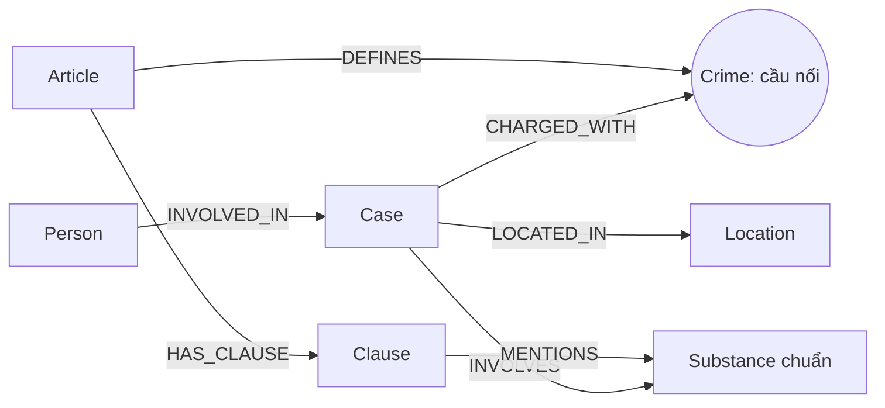

# Thiết kế Ontology — Day 19

**Họ tên:** Lê Nguyễn Quốc Bảo  **MSSV:** 2A202603011

**Lựa chọn:** Tự thiết kế trên nền ontology gợi ý: đổi khóa định danh, gộp tên chất đồng nghĩa và bổ sung dữ liệu khung hình phạt.

## 1. Sơ đồ

## 2. Entity types

| Label | Khóa `MERGE` | Properties chính | Nguồn, cách trích |
| --- | --- | --- | --- |
| `Article` | `id`, ví dụ `Điều 255 BLHS` | `title`, `law`, `doc_id` | Luật, metadata + regex |
| `Clause` | `id`, ví dụ `Điều 255 BLHS khoản 4` | `number`, `penalty`, `max_years`, `thresholds`, `text`, `doc_id` | Luật, regex; `thresholds` là các dòng ngưỡng nguyên văn |
| `Crime` | `name` chuẩn | `name` | Tiêu đề luật + tội danh trong tin, `link_entity` |
| `Case` | `id = doc_id#index` | `name`, `summary`, `date`, `source_title`, `doc_id` | Tin, LLM; `index` là vị trí vụ trong bài |
| `Person` | `key = lower(trim/collapse-space(name))` | `name`, `aliases` | Tin, LLM + chuẩn hóa bằng Python |
| `Substance` | `name` chuẩn | `name` | Luật regex; tin LLM + alias (`thuốc lắc`→`MDMA`, `ma túy đá`→`Methamphetamine`, `heroin`→`Heroine`) |
| `Location` | `name` | `name` | Tin, LLM |

`Article`, `Clause`, `Case` mang `doc_id` của tài liệu sinh ra chúng. `Crime`, `Person`, `Substance`, `Location` là node dùng chung giữa tài liệu nên không có một `doc_id` duy nhất. Cả bảy label đều có unique constraint trên khóa nêu trên. Graph cuối: 18 Article, 99 Clause, 13 Crime, 14 Case, 36 Person, 14 Substance, 7 Location.

## 3. Relationships

| Type | Từ → Đến | Properties | Ý nghĩa |
| --- | --- | --- | --- |
| `DEFINES` | Article → Crime | — | Điều luật định nghĩa tội |
| `HAS_CLAUSE` | Article → Clause | — | Khoản thuộc Điều |
| `MENTIONS` | Clause → Substance | — | Khoản nhắc tới chất |
| `CHARGED_WITH` | Case → Crime | — | Vụ được gán tội đã liên kết với luật |
| `INVOLVES` | Case → Substance | `amount` | Vụ liên quan chất và lượng do LLM trích |
| `LOCATED_IN` | Case → Location | — | Nơi xảy ra/xét xử theo bài |
| `INVOLVED_IN` | Person → Case | `role`, `sentence`, `charge` | Vai trò, án và tội cá nhân trong vụ |

## 4. Node cầu nối giữa hai KB

`Crime` nối `(Case)-[:CHARGED_WITH]->(Crime)<-[:DEFINES]-(Article)`. Tiêu đề Điều luật được chuẩn hóa bằng `normalize_crime`; prompt đưa danh sách tội chuẩn cho LLM và kết quả vẫn được kiểm lại bằng `link_entity` (exact rồi fuzzy cutoff 0.8). Không nối khi độ giống thấp, tránh suy đoán tội sai. Cầu gãy nếu bài không nêu tội trong corpus luật hoặc LLM bỏ sót: vụ tông CSGT An Giang có tội “chống người thi hành công vụ”, nằm ngoài tập Điều luật ma túy, nên không có `CHARGED_WITH`; đây là giới hạn KB hợp lý.

## 5. Competency questions

| Câu | Đường đi trên graph và dữ liệu bổ sung | Trả lời được? |
| --- | --- | --- |
| Q1 | Vector chunk Luật Phòng, chống ma túy 2021; `Article → Clause` nếu đã có Điều cụ thể | Có, chủ yếu nhờ vector; ontology không mô hình hóa khái niệm “tiền chất” riêng |
| Q2 | `Person-[:INVOLVED_IN {sentence}]->Case`; lọc vụ xét xử 36kg | Có |
| Q3 | `Person → Case → Crime ← Article → Clause(number=1)`; mức án ở `INVOLVED_IN.sentence` | Có |
| Q4 | Bí danh `aliases` → `Person → Case → Crime ← Article → Clause` có `max_years` lớn nhất | Có; khoản 4 Điều 255 cho chung thân |
| Q5 | `Person → Case → Crime ← Article → Clause`; thêm `Case → Substance ← Clause`, `amount` và `thresholds` nguyên văn | Có mức hỗ trợ: LLM vẫn phải đối chiếu 9,6kg với ngưỡng 100g của khoản 4 |
| Q6 | `Substance {name:'MDMA'} ← INVOLVES - Case ← INVOLVED_IN - Person` | Một phần; graph lấy được vụ, nhưng tóm tắt LLM có thể bỏ tên người hoặc chọn vụ không đúng đáp án chuẩn |

## 6. Quyết định thiết kế và đánh đổi

1. `Case` khóa theo `doc_id#index` thay vì tên do LLM đặt. Tên vụ thay đổi giữa lần trích vẫn thuộc đúng tài liệu; đánh đổi là hai bài nói cùng một vụ chưa tự hợp nhất. Mẫu hiện tại đều 14 Case/14 tài liệu ở cả hai bản, nên cải tiến khóa chưa tạo chênh lệch số node trong benchmark này.
2. `Substance` gộp alias trước `MERGE`, thay vì giữ nguyên tên LLM. Graph từ 17 xuống 14 node chất, giảm chia tách giữa các cách gọi; đánh đổi là tên chung “ma túy” vẫn không thể tự suy thành chất cụ thể.
3. Giữ `Clause` theo khoản và thêm `max_years`, `thresholds` thay vì tạo node cho từng khung/điểm. Truy xuất được khoản nặng nhất với graph nhỏ; ngưỡng còn là chuỗi nên chưa suy luận số học chắc chắn.
4. Chưa thêm `Stage`: bài báo trộn bắt, khởi tố, xét xử và phúc thẩm, LLM trích một nhãn đơn dễ sai. `role`/`sentence` trên `INVOLVED_IN` giữ các dữ kiện có thể kiểm chứng; giai đoạn tố tụng cần tập nhãn và đánh giá riêng.

## 7. So với ontology gợi ý

| Điểm khác | Gợi ý | Bản này | Vấn đề giải quyết và bằng chứng |
| --- | --- | --- | --- |
| Khóa Case | `MERGE name` | `MERGE id=doc_id#index` | Tránh tên vụ do LLM biến đổi gây tách/gộp sai; mẫu 14/14 ở cả hai nên hiệu quả này chưa có chênh lệch đo được |
| Khóa Person | `MERGE name` | `MERGE key` tên viết thường, chuẩn khoảng trắng | Gộp biến thể hoa/khoảng trắng; mẫu đều 36 Person nên chưa chứng minh được giảm node |
| Substance | `MERGE name` thô | canonical + alias | `MATCH (s:Substance) RETURN s.name`: trước có `Ketamine`/`ketamine`, `Methamphetamine`/`methamphetamine`, `MDMA`/`thuốc lắc`; sau còn một node cho mỗi cặp. Tổng 17→14 |
| Hình phạt Clause | Chỉ `penalty`, context khoản 1 và chất | `max_years`, `thresholds`, context thêm khoản có mức cao nhất | Điều 255 khoản 4 có `max_years=99` (chung thân); Q4 GraphRAG trước trả sai tối đa 7 năm (recall .67/judge 1), sau trả 20 năm hoặc chung thân (1.00/2) |

Hai lần benchmark đều dùng OpenAI `gpt-4o-mini` và `text-embedding-3-small`; số liệu chi tiết ở `ket_qua_benchmark_kg.hint.txt` và `ket_qua_benchmark_kg.txt`. LLM có biến thiên, nên thay đổi điểm không tự nó chứng minh quan hệ nhân quả; Cypher khoản 4 và khác biệt ngữ cảnh cung cấp bằng chứng trực tiếp hơn cho Q4.

## 8. Hạn chế còn lại

Ngưỡng khối lượng chưa được phân tích thành khoảng số + đơn vị chuẩn; không thể chứng minh tự động khoản áp dụng cho mọi lượng. `Person` cùng tên ngoài đời có thể bị gộp nhầm. `Case` cùng vụ ở hai bài vẫn tách. `Substance` tên chung và tên mới ngoài bảng alias vẫn tạo node riêng. `INVOLVED_IN.charge` có thể rỗng khi báo không nêu hoặc LLM bỏ sót. Q6 vẫn thiếu tên người trong câu trả lời dù graph có các vụ liên quan MDMA.
